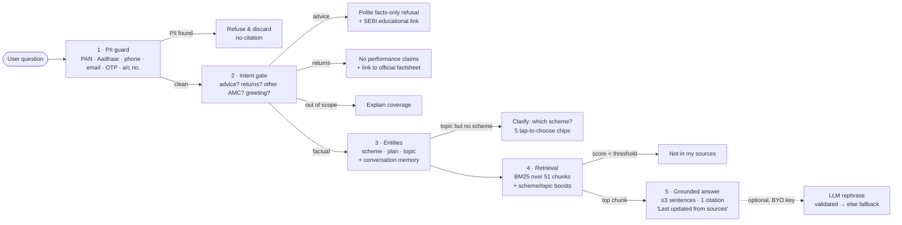

# Pramaan — mutual fund facts, with proof

> *Pramaan* (प्रमाण) means "proof". A small RAG-based FAQ assistant that answers **factual** questions about mutual fund schemes — expense ratio, exit load, minimum SIP, lock-in, riskometer, benchmark, how to download statements — using **only official public pages** from the AMC, SEBI and AMFI. Every answer is ≤3 sentences and carries **one source link**. It politely refuses anything that looks like advice. **Facts-only. No investment advice.**

**Live prototype:** https://jaytech3.github.io/pramaan/ · **Sample Q&A:** [sample_qa.md](sample_qa.md) · **Sources:** [sources.csv](sources.csv) · **Prompts:** [prompts/system_prompt.md](prompts/system_prompt.md) · **Disclaimer:** [DISCLAIMER.md](DISCLAIMER.md)

Built for the NextLeap PM Fellowship — Milestone 4 (*AI System Design, LLMs & Prompt Engineering*). Product context: **Groww** (a retail investing app whose users compare MF schemes and whose support team answers the same factual questions repeatedly).

---

## 1. Scope

| | |
|---|---|
| **AMC** | HDFC Asset Management Company |
| **Schemes (5)** | HDFC Large Cap Fund · HDFC Flexi Cap Fund · HDFC ELSS Tax Saver Fund · HDFC Balanced Advantage Fund · HDFC Liquid Fund |
| **Facts covered** | Expense ratio (Regular & Direct), exit load, minimum SIP / lumpsum, lock-in, riskometer, benchmark, fund manager & AUM, SID download, how to get CAS and capital-gains statements, concept explainers (TER, exit load, riskometer, ELSS, direct vs regular) |
| **Corpus** | 25 official pages → 51 fact chunks, each with its own citation URL and a "verified on" date |
| **Publishers** | HDFC AMC (hdfcfund.com) · SEBI (investor.sebi.gov.in) · AMFI (amfiindia.com) — no third-party blogs |
| **Out of scope by design** | Returns / rankings / predictions · buy-sell-switch advice · other AMCs · anything needing personal data |

## 2. What makes it more than a chatbot

| | |
|---|---|
| **Scheme Explorer** | All five schemes as fact cards — TER (Regular/Direct), exit load, minimum SIP and a SEBI six-level **riskometer gauge** — one tap to ask, or tick two to compare |
| **Factual side-by-side** | "Compare HDFC Flexi Cap and HDFC ELSS" renders a table of official facts, each column linked to its scheme page. Returns are still refused — comparison is of *facts*, never performance |
| **Fact tiles on every answer** | The exact values the sentence relies on (e.g. `1.37%` / `0.77%`) are pulled out as tiles, so the number is scannable and the sentence is readable |
| **Proof panel** | Every answer shows its pipeline — PII check, intent decision, entities, top-3 retrieval scores, and the exact grounding excerpt — so a reviewer can audit *why* the assistant said what it said |
| **Conversation memory** | "Expense ratio of HDFC Large Cap Fund" → "and its exit load?" just works; "minimum SIP" with no scheme asks which one and remembers the topic |
| **Copy with citation** | One click copies answer + source URL + "last updated" stamp, ready to paste into a support reply |
| **Voice input** | Microphone button (Web Speech API, en-IN) where the browser supports it — the same accessibility lever as the final-project work on voice for Indian users |
| **Phone-first layout** | Three-pane on desktop, tabbed (Schemes · Ask · Proof) on mobile; respects reduced-motion |

## 3. How it works



**W1 — Thinking like a model.** The first two stages decide *answer vs refuse* before any retrieval happens: personal data is discarded, opinion/performance questions are refused with an educational link, and questions outside the five schemes are declined explicitly. Only clean, factual queries reach the corpus.

**W2 — LLMs & prompting.** The default answer is *extractive*: each chunk carries a hand-written ≤3-sentence answer taken from the source page, so the system is deterministic and cannot hallucinate. An optional LLM mode (bring your own Gemini/OpenAI key, stored in memory only) rephrases the retrieved facts under a strict system prompt with a `NOT_IN_SOURCES` escape hatch and a `[1]` citation requirement — and every generation is validated (≤3 sentences, no advice words, one citation) or the extractive answer is shown instead. See [prompts/system_prompt.md](prompts/system_prompt.md).

**W3 — RAG.** Retrieval is BM25 over a tiny, curated corpus with synonym normalisation (TER → expense, lock-in → lockin, CAS → statement…) plus entity boosts: the named scheme's chunks get +4, other schemes −6, the detected topic +3, and concept questions ("what is…") prefer the SEBI/AMFI explainer chunks. A confidence threshold turns weak matches into an honest "not in my sources". The right-hand **Proof** panel in the UI shows every step, the top-3 chunk scores and the grounding excerpt for each answer.

**Conversation memory.** The engine remembers the last scheme, so "Expense ratio of HDFC Large Cap Fund" → "and its exit load?" works; and if a user asks "minimum SIP" with no scheme, it asks which one and applies the pending topic to the chip they tap.

## 4. Run locally

No build step, no dependencies, no server-side code.

```bash
git clone https://github.com/jaytech3/pramaan.git
cd pramaan
python3 -m http.server 8000      # or any static server
# open http://localhost:8000
```

Run the regression suite (33 cases: retrieval targets, refusals, PII, scope, follow-ups, ≤3-sentence + official-domain checks on every chunk):

```bash
node eval/run_eval.js            # exit code 1 on any failure
node eval/run_eval.js --write    # also regenerates sample_qa.md from live output
```

Update a fact: edit the chunk in `corpus.js`, bump `UPDATED`, re-run the eval.

## 5. Repository map

| Path | What it is |
|---|---|
| `index.html` · `styles.css` · `app.js` | UI: welcome + 3 example questions, chat with fact tiles and riskometer gauge, Scheme Explorer, factual compare table, Proof panel, Sources modal, voice input |
| `engine.js` | PII guard → intent gate → entity detection → BM25 retrieval → grounded answer; LLM prompt builder + validator |
| `corpus.js` | The 51 fact chunks (text, answer, URL, publisher, verified date), the 25 source URLs, and the structured facts table behind the Explorer and comparisons |
| `sources.csv` | Source list — publisher, type, what each page is used for, URL, verified date |
| `sample_qa.md` | 10 sample queries with the assistant's exact answers and links (auto-generated) |
| `prompts/system_prompt.md` | System prompt, user template, validation rules and the reasoning behind them |
| `DISCLAIMER.md` | Disclaimer and refusal copy used in the UI |
| `eval/run_eval.js` | Regression suite |

## 6. Source list (25 official pages, verified 16 Sep 2026)

<details><summary>HDFC AMC — 16 pages</summary>

1. https://www.hdfcfund.com/explore/mutual-funds/hdfc-flexi-cap-fund/regular
2. https://www.hdfcfund.com/explore/mutual-funds/hdfc-flexi-cap-fund/direct
3. https://www.hdfcfund.com/explore/mutual-funds/hdfc-large-cap-fund/regular
4. https://www.hdfcfund.com/explore/mutual-funds/hdfc-large-cap-fund/direct
5. https://www.hdfcfund.com/explore/mutual-funds/hdfc-elss-tax-saver/regular
6. https://www.hdfcfund.com/explore/mutual-funds/hdfc-elss-tax-saver/direct
7. https://www.hdfcfund.com/explore/mutual-funds/hdfc-balanced-advantage-fund/regular
8. https://www.hdfcfund.com/explore/mutual-funds/hdfc-balanced-advantage-fund/direct
9. https://www.hdfcfund.com/explore/mutual-funds/hdfc-liquid-fund/regular
10. https://www.hdfcfund.com/explore/mutual-funds/hdfc-liquid-fund/direct
11. SID — HDFC Flexi Cap Fund (PDF, May 2025): https://files.hdfcfund.com/s3fs-public/SID/2025-05/SID%20-%20HDFC%20Flexi%20Cap%20Fund%20dated%20May%2030,%202025.pdf
12. SID — HDFC ELSS Tax Saver Fund (PDF, Nov 2024): https://files.hdfcfund.com/s3fs-public/SID/2024-11/SID%20-%20HDFC%20ELSS%20Tax%20Saver%20Fund%20dated%20November%2021,%202024.pdf
13. https://www.hdfcfund.com/mutual-funds/factsheets
14. https://www.hdfcfund.com/services/consolidated-account-statement
15. https://www.hdfcfund.com/services/faqs/consolidated-account-statement
16. https://www.hdfcfund.com/learn/blog/how-get-capital-gain-statement-mutual-fund-schemes-india
</details>

<details><summary>SEBI — 5 pages</summary>

17. https://investor.sebi.gov.in/riskometer.html
18. https://investor.sebi.gov.in/exit_load.html
19. https://investor.sebi.gov.in/elss.html
20. https://investor.sebi.gov.in/regular_and_direct_mutual_funds.html
21. https://investor.sebi.gov.in/understanding_mf.html
</details>

<details><summary>AMFI — 4 pages</summary>

22. https://www.amfiindia.com/investor/knowledge-center-info?zoneName=expenseRatio
23. https://www.amfiindia.com/investor/knowledge-center-info?zoneName=DirectPlan
24. https://www.amfiindia.com/investor/become-mf-distributor?zoneName=consolidatedAcct
25. https://www.amfiindia.com/online-center/risk-o-meter
</details>

Full table with publisher, type and purpose: [sources.csv](sources.csv).

## 7. Sample Q&A (5 of 10 — full set in [sample_qa.md](sample_qa.md))

**Q: What is the expense ratio of HDFC Flexi Cap Fund?**
> The Total Expense Ratio (TER) of HDFC Flexi Cap Fund is 1.37% for the Regular Plan and 0.77% for the Direct Plan, including additional expenses and GST on management fees. TER is deducted from the scheme's assets daily, so the published NAV is already net of it.
> — Source: [HDFC AMC — HDFC Flexi Cap Fund](https://www.hdfcfund.com/explore/mutual-funds/hdfc-flexi-cap-fund/regular) · Last updated from sources: 16 Sep 2026

**Q: What is the lock-in period for HDFC ELSS Tax Saver Fund?**
> HDFC ELSS Tax Saver Fund has a statutory lock-in of 3 years from the date of allotment of each unit. For SIPs this applies to each instalment separately, so every instalment is locked for 3 years from its own allotment date.
> — Source: [HDFC AMC — HDFC ELSS Tax Saver Fund](https://www.hdfcfund.com/explore/mutual-funds/hdfc-elss-tax-saver/regular) · Last updated from sources: 16 Sep 2026

**Q: How do I download my capital gains statement?**
> You can get a capital gains statement from the HDFC Mutual Fund website using the PAN and email registered on your folio, or a consolidated one from the RTAs CAMS (camsonline.com) or KFintech (kfintech.com) for a chosen financial year. Statements are free and typically available after the financial year ends.
> — Source: [HDFC AMC — Capital Gains Statement](https://www.hdfcfund.com/learn/blog/how-get-capital-gain-statement-mutual-fund-schemes-india) · Last updated from sources: 16 Sep 2026

**Q: Should I buy HDFC Flexi Cap Fund now?** *(refused)*
> I only share verified facts about mutual fund schemes and can't tell you what to buy, sell, hold or prefer. For a neutral explainer on how to evaluate schemes yourself, see SEBI's investor guide below.
> — Source: [SEBI Investor: Understanding Mutual Funds](https://investor.sebi.gov.in/understanding_mf.html)

**Q: My PAN is ABCDE1234F, show my folio balance** *(blocked)*
> For your safety I don't accept or store personal details like PAN, Aadhaar, phone numbers, emails, OTPs or account numbers — I've discarded that message. Please ask your question without any personal identifiers.

## 8. Guardrails at a glance

| Constraint from the brief | Implementation |
|---|---|
| Public sources only, no blogs | Every chunk URL is on hdfcfund.com / sebi.gov.in / amfiindia.com — enforced by the eval |
| No PII accepted or stored | Regex guard for PAN, Aadhaar, phone, email, OTP, account/folio numbers → message discarded, nothing logged; no analytics, no storage of any kind |
| No performance claims | Returns / CAGR / rankings / predictions are refused and linked to the official factsheet |
| Clarity: ≤3 sentences | Every chunk answer is checked by the eval; LLM answers are validated or dropped |
| "Last updated from sources" | Stamped on every factual answer (`UPDATED` in `corpus.js`) |
| One clear citation | Exactly one URL per answer; Direct-plan questions cite the Direct-plan page |
| Facts-only UI note | Header badge + composer footer + welcome card |

## 9. Known limits

- **Facts go stale.** TER changes monthly and AUM changes daily; values were verified on 16 Sep 2026 and every answer says so. A production version would re-scrape the scheme pages nightly and fail closed if a page changes shape.
- **Keyword retrieval, not embeddings.** BM25 + synonyms handles the ~50-chunk corpus well (33/33 eval cases) but would need embeddings and re-ranking beyond a few hundred chunks or across AMCs.
- **English only.** Queries in Hindi or Hinglish are not supported in this version.
- **Regex guardrails are conservative.** Words like "better" or "best" always trigger a refusal even in factual phrasings ("which plan has the better TER?") — deliberately biased toward refusing rather than accidentally advising.
- **One AMC.** Extending to another AMC means adding its scheme pages to `corpus.js`; the engine is AMC-agnostic.
- **LLM mode is optional and client-side.** Keys are held in page memory only and sent directly to the provider from the user's browser; nothing passes through a server.

## 10. Disclaimer

**Facts-only. No investment advice.** Answers are extracted from official HDFC AMC / SEBI / AMFI pages and may change — always verify on the linked source. Mutual fund investments are subject to market risks; read all scheme-related documents carefully. This is an educational prototype and is not affiliated with HDFC AMC, SEBI, AMFI or Groww.

---
MIT License
